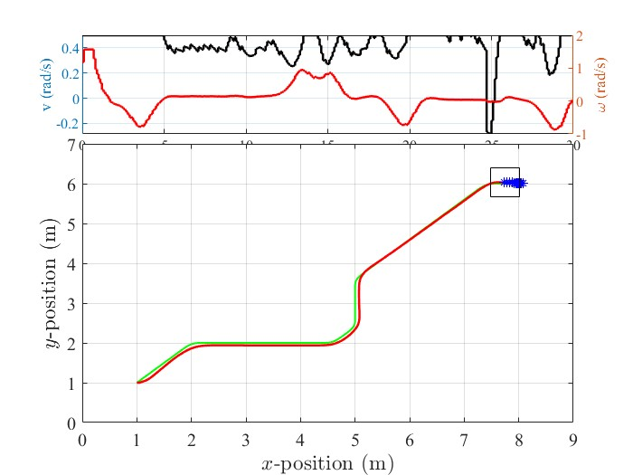

# Omni-drive-robot-Simulation
Design and Performance Comparison of FuzzyPID and Non-linear Model Predictive Controller for Trajectory Tracking of 4-Wheel Omni-drive Robot.

## Requirements:
* matlab/simulink
* CoppeliaSim Edu version

## Installation
Run this command on command prompt to clone the repository

`git clone https://github.com/love481/Omni-drive-robot-Simulation.git`


## Usage
Use the following script to initialize the path of working directory
```
startup.m
```

Make sure to open the CoppeliaSim simulation environment before running below code.
Use the following scripts for running the simulation:
```
# For tracking using fuzzyPID
fuzzyPID_vrep.m

# For tracking using NMPC
mpc_vrep.m

```

## folder Structure
* `scene` --> Simulation Environment for the robot
* `code/common` --> Contains the common utility classes or functions needed to initialize the remote connection, initializing diffrent PID algorithms, trajectory generators, tranformation and so on.
* `code/omni_drive` --> Contains Fuzzy inference system along with scripts for trajectory tracking of omni-drive robot using both fuzzyPID and NMPC.


#### Visualization of Position and Velocity Tracking for NMPC



## Contact Information
Please feel free to contact me if any help needed

Email: *075bei016.love@pcampus.edu.np*

